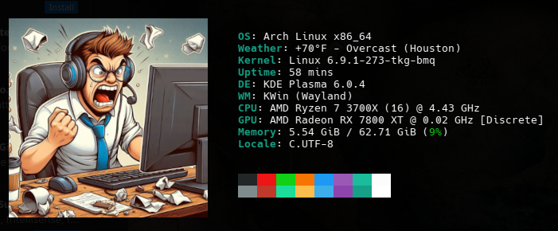

# fastfetch-config

This configuration file supports an image, and weather+custom location as well as some system specs.

# Example Image

# Requirements

You must have fastfetch installed already. See https://github.com/fastfetch-cli/fastfetch

Your terminal must support displaying images. For example, Konsole. 

# Usage

Place the config.jsonc file in ~/.config/fastfetch/config.jsonc

Modify the config.jsonc file and change the path to your image

If you want more options to be displayed, check out the examples: 
https://github.com/fastfetch-cli/fastfetch/tree/dev/presets/examples